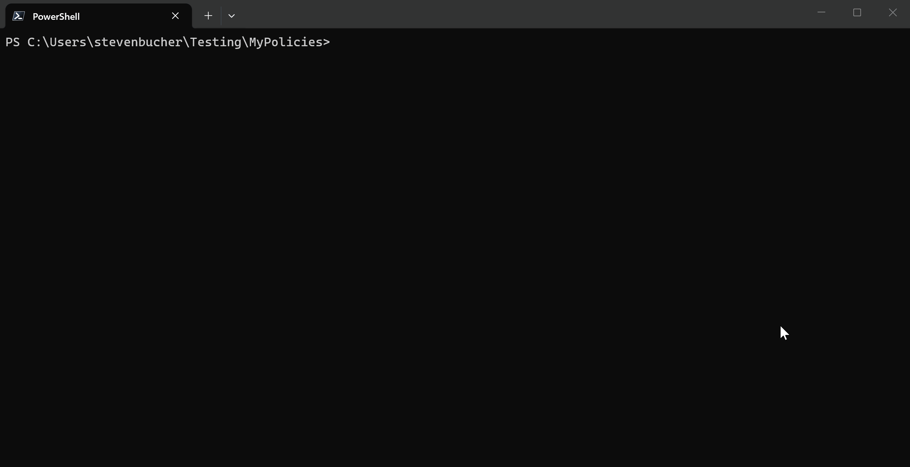

#  Azure Policy Linter

Repository for the Azure Policy Linter tool that you can run against your authored policy
definitions to check for rules and best practices.

## Installation

<TODO: Add installation instructions here once the linter is published to a package manager or made available for download.>

## Usage

The linter supports processing single or multiple policy definition files:

### Single file
```
policylinter c:\path\to\policyDefinition.json
```

### Multiple files

- Processes up to 1,000 files in a single run

```
policylinter c:\path\to\policy1.json c:\path\to\policy2.json c:\path\to\policy3.json
```

### With output to JSON file
```
policylinter c:\path\to\policy1.json c:\path\to\policy2.json --output results.json
```
or
```
policylinter c:\path\to\policy1.json -o results.json
```

### Rule sets

The linter organizes rules into rule sets for different linting scenarios. By default, the linter uses the "default" rule set which includes general-purpose rules.

List available rule sets:
```
policylinter --list-rule-sets
```

Apply a specific rule set:
```
policylinter policy.json --rule-set BuiltIn
```

Apply multiple rule sets:
```
policylinter policy.json --rule-set BuiltIn --rule-set default
```

### Rule documentation

Each rule has a corresponding documentation file in the [docs/Rules/](docs/Rules/) directory.

### Help
```
policylinter --help
```

The linter accepts either a full policy definition resource payload or a JSON containing just the policy definition property bag. When processing multiple files, the linter processes them in parallel for improved performance and provides file-specific results.

## Known gaps and issues
- No support for the more obscure leaf expressions like `source`.
- No support for data-plane policies.
- No support for effect details.

## Linter rules

Each linter rule should have a corresponding documentation file [here](docs/Rules/).

## Demo Video



## Contributing

We are not accepting pull requests at this time. However, we welcome all feedback, bug reports,
issues, and suggestions. Please feel free to open an
[issue](https://github.com/Azure/azure-policy-linter/issues) to share your thoughts or report any
problems you encounter. For more information about contributing, please see our [Contributing guidelines](CONTRIBUTIONS.md).

## License

This project is licensed under the MIT License - see [LICENSE](LICENSE) file for details.

## Support

For issues, questions, or suggestions, please open an
[issue](https://github.com/Azure/azure-policy-linter/issues) on GitHub.

## Security

For security issues, please see our [Security policy](SECURITY.md).

## Trademark notice

Trademarks This project may contain trademarks or logos for projects, products, or services.
Authorized use of Microsoft trademarks or logos is subject to and must follow Microsoft’s Trademark
& Brand Guidelines. Use of Microsoft trademarks or logos in modified versions of this project must
not cause confusion or imply Microsoft sponsorship. Any use of third-party trademarks or logos are
subject to those third-party’s policies.

